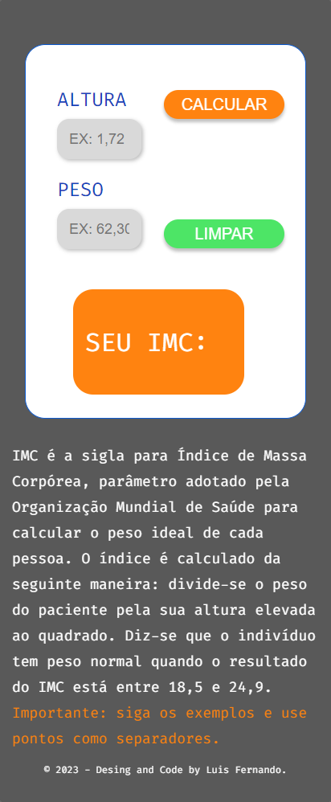

# IMC

Este é um projeto pessoal que desenvolvi afim de desafiar minhas habilidades, e tentar melhorar meus conhecimentos em: HTML, CSS e JavaScript

## Índice

- [Visão geral](#visão-geral)
   - [O desafio](#o-desafio)
   - [Captura de tela](#captura-de-tela)
- [Meu processo](#meu-processo)
   - [Construído com](#construído-com)
   - [O que aprendi](#o-que-aprendi)
- [Autor](#autor)

## Visão geral

Este site é capaz de realizar o calculo do IMC com base apenas na altura e peso do usuario

### O desafio

Os usuários devem ser capazes de:

- Ver o layout ideal para a página, dependendo do tamanho da tela do dispositivo
- Ver os estados de foco para todos os elementos interativos na página
- Fazer o calculo do IMC com base na altura e peso do usuario

### Captura de tela

## Meu processo

### Construído com

- Marcação HTML5 semântica
- Propriedades personalizadas CSS
- Pseudo-classes / Pseudo-elementos
- Grid
- Flexbox
- Media queries
- JavaScript

### O que eu aprendi

Consegui aprender bastante sobre os conceitos de media queries/responsividade e funções em JavaScript 

### NOTA:

Ainda falta alterar algumas coisas na responsividade, acredito que da para dar uma melhorada, assim como também falta melhorar a interatividade do usuario, mas ainda está em desenvolvimento e irei atualizando na medidia que for melhorando.

## Autor

- Linkedin - [Luis Fernando Macedo](https://www.linkedin.com/in/luis-fernando-macedo-7791ba219)